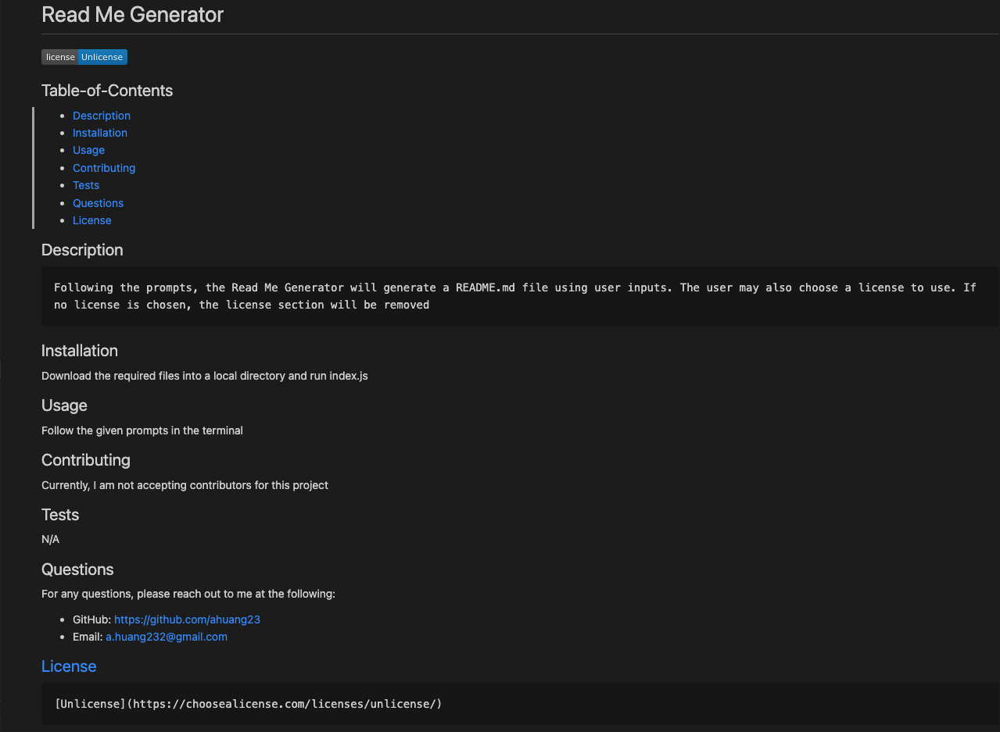

# Challenge 09

## Description
- This challenge was to create a README.md generator using nodejs and the Inquirer package. The app will generate a README.md file using the user's inputs to prompts given in the terminal. The user will also be able to choose a license. If no license is selected, then the license section of the README.md will not generate

## Sample

## Links
[GitHub](https://github.com/ahuang23/C09_ReadMe_Generator)
[Tutorial](https://watch.screencastify.com/v/I2UmQ8P4GMAhKOwW0YkM)